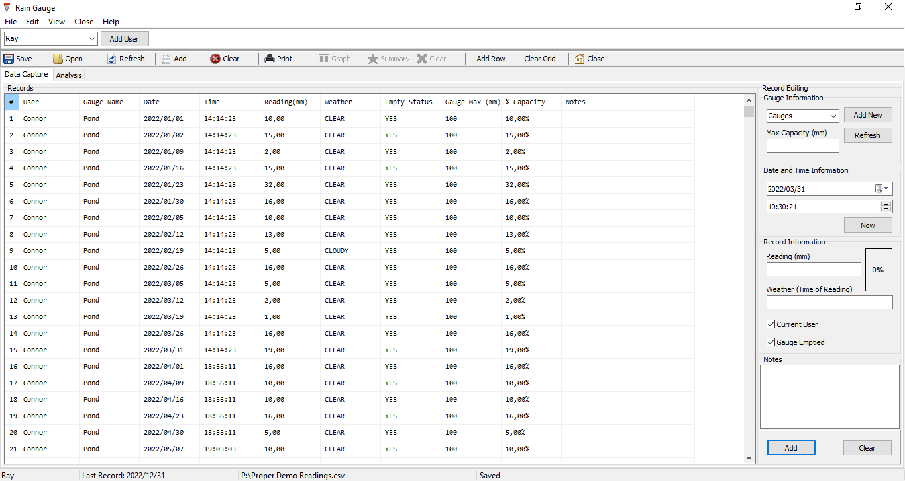
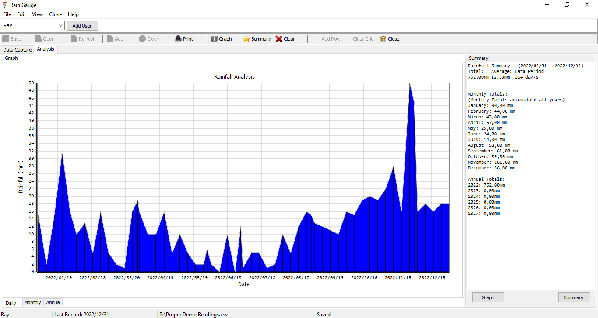
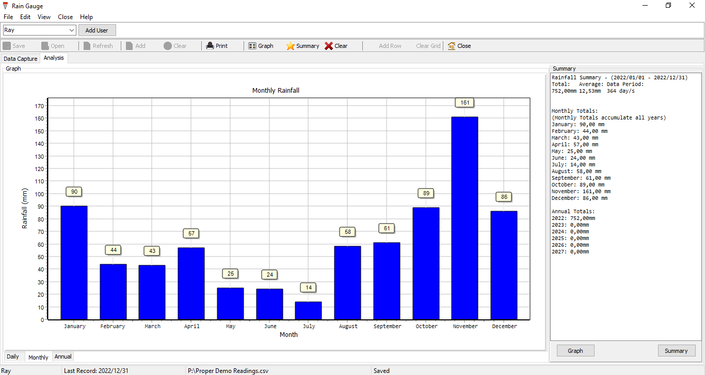
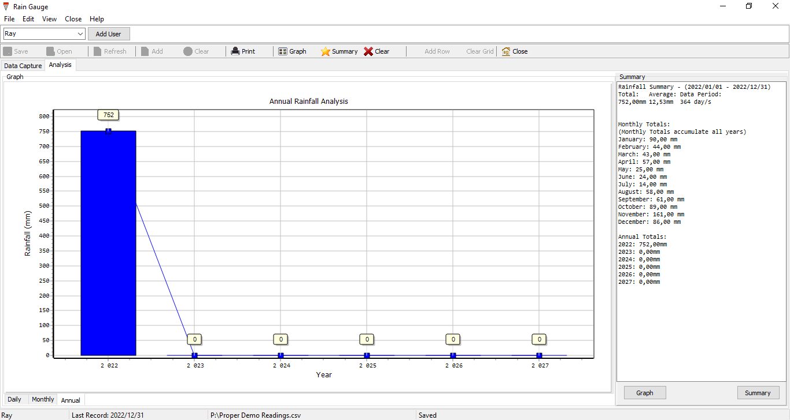

### Rain Gauge 
- Welcome to the Rain Gauge Application
- Latest Version: v1.0.1.1 
### New Changes
- See Latest Release! 
### Information
- © 2022 Connor Bell
- cbell@jeppeboys.co.za 
- +27 66 202 1724
***
# What It Looks Like

***
# Installation
Please read the following carefully. 
Rain Gauge makes use of text files to store and log user and gauge information. When installing the application to the Programs folder, these files become inaccessible (Only when installed for all users). This issue can be avoided by installing the application for the current user only. 
To install Rain Gauge, locate the installer `Rain Gauge vX.X.X.X Installer` `.exe` file and run it. 

***
 
# Getting Started 
Rain Gauge makes recording, logging, graphing and summarizing rainfall easy. When installation is complete, you must add a user and a gauge. To add a use, click `Add User` on the top pane, and enter a name. To add a gauge, navigate to the 'Recording Information' pane and click `Add New`, suppling a name and max capacity. Then refresh both these fields by using the keyboard shortcuts `Ctrl + R` and `Ctrl + Q` or navigate to the menu bar. This information is then stored in a text file, so it is easily accessible upon application relaunch. 
## Adding a record
Adding a record is easy. First select a gauge and get the max capacity. Then select the date and time of reading and click `Apply`. It is important to click apply to get the correct date. Then supply the reading and weather (at time of reading) information. You can also check the if you recorded it or someone else did, and whether it was emptied. To record, click `Apply`. 

## Save or Open Records
Rain Gauge File information is stored as a `.csv`. You can save rainfall records easily as files for later use by clicking `Save` and `Open` to import saved records or by navigating to the main menu. 

## Graph and Summarize Records
  
Records can be easily visualized and summarized under the 'Analysis' tab sheet. Once and adequate number of records have been logged, click `Graph` to draw an area graph and `Summary` to show Total and Average rainfall as well as the period of data recording in days. 

## Printing
Records, Graphs and summaries can be printed. Navigate to the main menu and print your desired information.

***

# Updates
Updates may be regular and will always be made available on the GitHub platform. Please periodically check this repo and update to the latest version. You will need to uninstall previous versions of Rain Gauge from the Programs and Features control panel. 

***

# Disclaimer and License
Copyright (c) 2022 Connor Bell 

Permission is hereby granted, free of charge, to any person obtaining a copy
of this software and associated documentation files (the "Software"), to deal
in the Software without restriction, including without limitation the rights
to use, copy, modify, merge, publish, distribute, sublicense, and/or sell
copies of the Software, and to permit persons to whom the Software is
furnished to do so, subject to the following conditions:

The above copyright notice and this permission notice shall be included in all
copies or substantial portions of the Software.

THE SOFTWARE IS PROVIDED "AS IS", WITHOUT WARRANTY OF ANY KIND, EXPRESS OR
IMPLIED, INCLUDING BUT NOT LIMITED TO THE WARRANTIES OF MERCHANTABILITY,
FITNESS FOR A PARTICULAR PURPOSE AND NONINFRINGEMENT. IN NO EVENT SHALL THE
AUTHORS OR COPYRIGHT HOLDERS BE LIABLE FOR ANY CLAIM, DAMAGES OR OTHER
LIABILITY, WHETHER IN AN ACTION OF CONTRACT, TORT OR OTHERWISE, ARISING FROM,
OUT OF OR IN CONNECTION WITH THE SOFTWARE OR THE USE OR OTHER DEALINGS IN THE
SOFTWARE.

# Feedback
Feedback is greatly appreciated. Please feel free to send feedback in any regard to: 
- cbell@jeppeboys.co.za

- Published (4 March 2022)
- Updated (31 March 2022)
